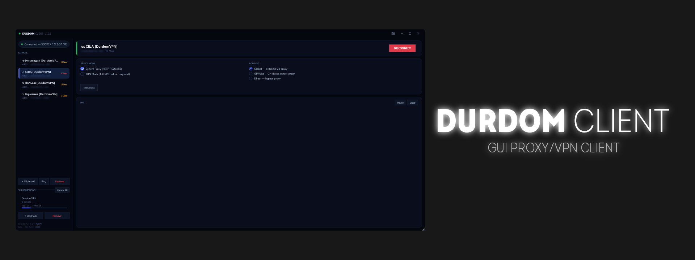

# Durdom Client

A simple and user-friendly client for working with proxy and VPN connections.

*This is not a service with pre-configured or built-in servers. It is a universal client for proxy and VPN connections with subscription support.*

## ✨ Features
- Support for VLESS, VMess, Trojan, Shadowsocks, Hysteria2
- Low CPU and RAM usage
and maybe more...

## 💡 To-Do
- Fix TUN mode
- Light Theme
- Verison Info and Update Button
- Android support
- Linux support
